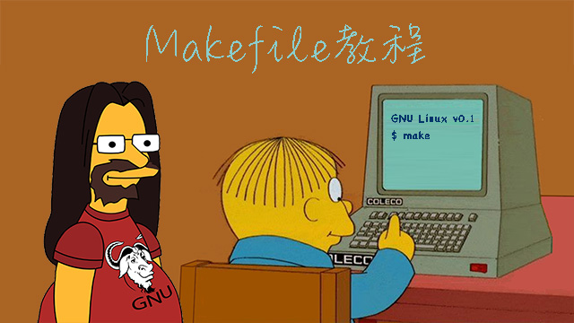

# Makefile教程



Linux的`make`程序用来自动化编译大型源码，很多时候，我们在Linux下编译安装软件，只需要敲一个`make`就可以全自动完成，非常方便。

`make`能自动化完成这些工作，是因为项目提供了一个`Makefile`文件，它负责告诉`make`，应该如何编译和链接程序。

`Makefile`相当于Java项目的`pom.xml`，Node工程的`package.json`，Rust项目的`Cargo.toml`，不同之处在于，`make`虽然最初是针对C语言开发，但它实际上并不限定C语言，而是可以应用到任意项目，甚至不是编程语言。此外，`make`主要用于Unix/Linux环境的自动化开发，掌握`Makefile`的写法，可以更好地在Linux环境下做开发，也可以为后续开发Linux内核做好准备。

在本教程中，我们将由浅入深，一步一步学习如何编写`Makefile`，完全针对零基础小白，只需要提前掌握如何使用Linux命令。

## 安装make

安装`make`时，因为`make`只能在Unix/Linux下运行，所以，如果使用Windows系统，我们要先想办法在Windows下跑一个Linux。

方法一：安装[VirtualBox](https://www.virtualbox.org/)，然后下载Linux发行版安装盘，推荐[Ubuntu 22.04](https://releases.ubuntu.com/jammy/)，这样就可以在虚拟机中运行Linux。

方法二：对于Windows 10/11，可以首先安装WSL（Windows Subsystem for Linux）：


然后，在Windows应用商店，搜索Ubuntu 22.04，直接安装后运行，Windows会弹出PowerShell的窗口连接到Linux，在PowerShell中即可输入Linux命令，和SSH连接类似。

以Ubuntu为例，在Linux命令行下，用`apt`命令安装`make`以及GCC工具链：

```bash
$ sudo apt install build-essential
```

对于macOS系统，因为它的内核是BSD（一种Unix），所以也能直接跑`make`，推荐安装Homebrew，然后通过Homebrew安装`make`以及GCC工具链：

```bash
$ brew install make gcc
```

安装完成后，可以输入`make -v`验证：

```bash
$ make -v
GNU Make 4.3
...
```

输入`gcc --version`验证GCC工具链：

```bash
$ gcc --version
gcc (Ubuntu ...) 11.4.0
...
```

这样，我们就成功地安装了`make`，以及GCC工具链。

## Makefile基础

在Linux环境下，当我们输入`make`命令时，它就在当前目录查找一个名为`Makefile`的文件，然后，根据这个文件定义的规则，自动化地执行任意命令，包括编译命令。

`Makefile`这个单词，顾名思义，就是指如何生成文件。

我们举个例子：在当前目录下，有3个文本文件：`a.txt`，`b.txt`和`c.txt`。

现在，我们要合并`a.txt`与`b.txt`，生成中间文件`m.txt`，再用中间文件`m.txt`与`c.txt`合并，生成最终的目标文件`x.txt`，整个逻辑如下图所示：

```ascii
┌─────┐ ┌─────┐ ┌─────┐
│a.txt│ │b.txt│ │c.txt│
└─────┘ └─────┘ └─────┘
   │       │       │
   └───┬───┘       │
       │           │
       ▼           │
    ┌─────┐        │
    │m.txt│        │
    └─────┘        │
       │           │
       └─────┬─────┘
             │
             ▼
          ┌─────┐
          │x.txt│
          └─────┘
```

根据上述逻辑，我们来编写`Makefile`。

### 规则

`Makefile`由若干条规则（Rule）构成，每一条规则指出一个目标文件（Target），若干依赖文件（prerequisites），以及生成目标文件的命令。

例如，要生成`m.txt`，依赖`a.txt`与`b.txt`，规则如下：

```
# 目标文件: 依赖文件1 依赖文件2
m.txt: a.txt b.txt
	cat a.txt b.txt > m.txt
```

一条规则的格式为`目标文件: 依赖文件1 依赖文件2 ...`，紧接着，以Tab开头的是命令，用来生成目标文件。上述规则使用`cat`命令合并了`a.txt`与`b.txt`，并写入到`m.txt`。用什么方式生成目标文件`make`并不关心，因为命令完全是我们自己写的，可以是编译命令，也可以是`cp`、`mv`等任何命令。

以`#`开头的是注释，会被`make`命令忽略。

```!
注意：Makefile的规则中，命令必须以Tab开头，不能是空格。
```

类似的，我们写出生成`x.txt`的规则如下：

```
x.txt: m.txt c.txt
	cat m.txt c.txt > x.txt
```

由于`make`执行时，默认执行第一条规则，所以，我们把规则`x.txt`放到前面。完整的`Makefile`如下：

```
x.txt: m.txt c.txt
	cat m.txt c.txt > x.txt

m.txt: a.txt b.txt
	cat a.txt b.txt > m.txt
```

在当前目录创建`a.txt`、`b.txt`和`c.txt`，输入一些内容，执行`make`：

```bash
$ make
cat a.txt b.txt > m.txt
cat m.txt c.txt > x.txt
```

`make`默认执行第一条规则，也就是创建`x.txt`，但是由于`x.txt`依赖的文件`m.txt`不存在（另一个依赖`c.txt`已存在），故需要先执行规则`m.txt`创建出`m.txt`文件，再执行规则`x.txt`。执行完成后，当前目录下生成了两个文件`m.txt`和`x.txt`。

可见，`Makefile`定义了一系列规则，每个规则在满足依赖文件的前提下执行命令，就能创建出一个目标文件，这就是英文Make file的意思。

把默认执行的规则放第一条，其他规则的顺序是无关紧要的，因为`make`执行时自动判断依赖。

此外，`make`会打印出执行的每一条命令，便于我们观察执行顺序以便调试。

如果我们再次运行`make`，输出如下：

```bash
$ make
make: `x.txt' is up to date.
```

`make`检测到`x.txt`已经是最新版本，无需再次执行，因为`x.txt`的创建时间晚于它依赖的`m.txt`和`c.txt`的最后修改时间。

```?
make使用文件的创建和修改时间来判断是否应该更新一个目标文件。
```

修改`c.txt`后，运行`make`，会触发`x.txt`的更新：

```bash
$ make
cat m.txt c.txt > x.txt
```

但并不会触发`m.txt`的更新，原因是`m.txt`的依赖`a.txt`与`b.txt`并未更新，所以，`make`只会根据`Makefile`去执行那些必要的规则，并不会把所有规则都无脑执行一遍。

在编译大型程序时，全量编译往往需要几十分钟甚至几个小时。全量编译完成后，如果仅修改了几个文件，再全部重新编译完全没有必要，用`Makefile`实现增量编译就十分节省时间。

当然，是否能正确地实现增量更新，取决于我们的规则写得对不对，`make`本身并不会检查规则逻辑是否正确。

### 伪目标

因为`m.txt`与`x.txt`都是自动生成的文件，所以，可以安全地删除。

删除时，我们也不希望手动删除，而是编写一个`clean`规则来删除它们：

```
clean:
	rm -f m.txt
	rm -f x.txt
```

`clean`规则与我们前面编写的规则有所不同，它没有依赖文件，因此，要执行`clean`，必须用命令`make clean`：

```bash
$ make clean
rm -f m.txt
rm -f x.txt
```

然而，在执行`clean`时，我们并没有创建一个名为`clean`的文件，所以，因为目标文件`clean`不存在，每次运行`make clean`，都会执行这个规则的命令。

如果我们手动创建一个`clean`的文件，这个`clean`规则就不会执行了！

如果我们希望`make`把`clean`不要视为文件，可以添加一个标识：

```makefile
.PHONY: clean
clean:
	rm -f m.txt
	rm -f x.txt
```

此时，`clean`就不被视为一个文件，而是伪目标（Phony Target）。

大型项目通常会提供`clean`、`install`这些约定俗成的伪目标名称，方便用户快速执行特定任务。

一般来说，并不需要用`.PHONY`标识`clean`等约定俗成的伪目标名称，除非有人故意搞破坏，手动创建名字叫`clean`的文件。

### 执行多条命令

一个规则可以有多条命令，例如：

```makefile
cd:
	pwd
	cd ..
	pwd
```

执行`cd`规则：

```
$ make cd
pwd
/home/ubuntu/makefile-tutorial/v1
cd ..
pwd
/home/ubuntu/makefile-tutorial/v1
```

观察输出，发现`cd ..`命令执行后，并未改变当前目录，两次输出的`pwd`是一样的，这是因为`make`针对每条命令，都会创建一个独立的Shell环境，类似`cd ..`这样的命令，并不会影响当前目录。

解决办法是把多条命令以`;`分隔，写到一行：

```makefile
cd_ok:
	pwd; cd ..; pwd;
```

再执行`cd_ok`目标就得到了预期结果：

```bash
$ make cd_ok
pwd; cd ..; pwd
/home/ubuntu/makefile-tutorial/v1
/home/ubuntu/makefile-tutorial
```

可以使用`\`把一行语句拆成多行，便于浏览：

```makefile
cd_ok:
	pwd; \
	cd ..; \
	pwd
```

另一种执行多条命令的语法是用`&&`，它的好处是当某条命令失败时，后续命令不会继续执行：

```makefile
cd_ok:
	cd .. && pwd
```

### 控制打印

默认情况下，`make`会打印出它执行的每一条命令。如果我们不想打印某一条命令，可以在命令前加上`@`，表示不打印命令（但是仍然会执行）：

```makefile
no_output:
	@echo 'not display'
	echo 'will display'
```

执行结果如下：

```
$ make no_output
not display
echo 'will display'
will display
```

注意命令`echo 'not display'`本身没有打印，但命令仍然会执行，并且执行的结果仍然正常打印。

### 控制错误

`make`在执行命令时，会检查每一条命令的返回值，如果返回错误（非0值），就会中断执行。

例如，不使用`-f`删除一个不存在的文件会报错：

```makefile
has_error:
	rm zzz.txt
	echo 'ok'
```

执行上述目标，输出如下：

```bash
$ make has_error
rm zzz.txt
rm: zzz.txt: No such file or directory
make: *** [has_error] Error 1
```

由于命令`rm zzz.txt`报错，导致后面的命令`echo 'ok'`并不会执行，`make`打印出错误，然后退出。

有些时候，我们想忽略错误，继续执行后续命令，可以在需要忽略错误的命令前加上`-`：

```makefile
ignore_error:
	-rm zzz.txt
	echo 'ok'
```

执行上述目标，输出如下：

```bash
$ make ignore_error
rm zzz.txt
rm: zzz.txt: No such file or directory
make: [ignore_error] Error 1 (ignored)
echo 'ok'
ok
```

`make`检测到`rm zzz.txt`报错，并打印错误，但显示`(ignored)`，然后继续执行后续命令。

对于执行可能出错，但不影响逻辑的命令，可以用`-`忽略。

### 参考源码

可以从[GitHub](https://github.com/michaelliao/makefile-tutorial/tree/main/v1)下载源码。

### 小结

编写`Makefile`就是编写一系列规则，用来告诉`make`如何执行这些规则，最终生成我们期望的目标文件。

查看官方手册：

- [编写规则](https://www.gnu.org/software/make/manual/html_node/Rules.html)
- [执行命令](https://www.gnu.org/software/make/manual/html_node/Execution.html)
- [伪目标](https://www.gnu.org/software/make/manual/html_node/Phony-Targets.html)

